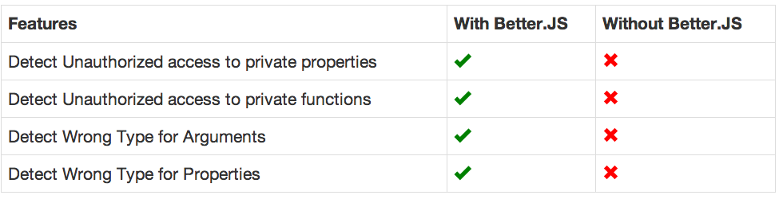

title: Better.js Introduction
output: index.html
--

<style>.slide-content{width: 1024px;}</style>
<style>.slide-content pre code {font-size:160%;}</style>
<style>.slide-content pre {background-color:lightgrey;}</style>
<style>.slide-content code {font-size:120%;}</style>
<style>h1 {margin-top:50px;}</style>
<base target='_blank'/>

# Better.js Introduction

## <a href='http://twitter.com/jerome_etienne'>@jerome_etienne</a>

--

### Introducing Better.js

* What is Better.js

* Better.js Installation In Browser

* Better.js Installation In Node.js

--

### Basic Usage Of Better.js

* Better.js For **Functions**

* Better.js For **Properties**

* Better.js For **Classes**

--

# The End

--

# What is Better.js

--

### Meta

* [homepage](http://betterjs.org)

* It helps you write a better javascript
* It ensure your javascript is running as it is intented
* you typically run it during your test phase
* like jshint, like mocha, qunit

--

### Meta2
* better.js extends javascript in revolutionary ways
* to support feature unseen to javascript
* such as private members and strong typing

* take the first 2 lines of the homepages

--

### Pure 100% Javascript

* no compilation step **=>** faster dev cycle

* no new language to learn **=>** no training for webdev

* 100% Javascript **=>** easier to integrate in your code

--

# An Example
## Simple One Just To See It Running

--

### An Example Of Strong Typing For Function

First let do a function to do addition

```
var add = function(n1,n2){
    return n1+n2
}
```

Misusing it with string

```
add(3, 'two')
// return '3two'
```

**No Error Detected with Plain Javascript**

--

### Using This Function

Overload add with a better.js function

```
add = Bjs.Function(add, {
    arguments : [Number, Number]
})
```

Using it with wrong type of arguments

```
add(3, 'two');
// Exception Thrown Invalid Type for Argument 2. 
// It should be Number
```

**Error Detected thanks to Better.js**

--

### Benefits

* Support for strong typing in javascript
* Arguments of wrong type are detected
* Misusages is notified imeddiatly to the developpers 

Earlier bugs detection leads to higher quality code

--

### OK tell us more 

--

# What Better.JS Can Do For You ?

--

### Better Classes



--

### Better Functions


--

### Better Properties


--

# The End

--

# Better.js Installation In Browser

--

### How To Install Better in Browser

* Install it in your project
* Include it in your page
* Use it in your application

--

### How To Install It? Download From Github

* Download it from [better.js github repository](http://github.com/jeromeetienne/better.js/)
* take ***/build/better.js*** folder as usual
* [direct link](https://raw.githubusercontent.com/jeromeetienne/better.js/master/build/better.js)

--

### How To Install It? Via Bower Package

* [bower](http://bower.io) package manager 
done by [twitter](http://twitter.com)
* bower is like "npm but for brower"

```
bower install better.js
```

--

### How To Include It In Your Code

With the usual [script tag](https://developer.mozilla.org/en/docs/Web/HTML/Element/script)

```
<script src="better.js"></script>
```
--

# An Example
## Just to check it is working

--

### Let's Have A Function

A simple add function to add numbers

```
function add(n1,n2){
    return n1+n2
}
```

--

### Let's Overload This Function With Better.js

Overload add with a better.js function

```
add = Bjs.Function(add, {
    arguments : [Number, Number]
})
```

Let's try a wrong return type with better.js

```
add(3, 'two');
// Exception 'invalid type for returned value.'
```

**Working OK**

--

## Let's pack it up.

--

### What Have We Learned ?

1. Install it via download From [better.js github repository](http://github.com/jeromeetienne/better.js/)

1. Install it with bower using **bower install better.js**

1. Include it in your page with **< script src="better.js">< /script> **

1. Simple Example of Better.js Function in browser

--

# The End

--

# Better.js Installation In Node.js

--

### How To Install Better in Node.js

* Install it in your project
* Include it in your code
* Use it in your application

--

### How To Install It

Using the usual npm install line

```
npm install better.js
```
--

### How To Include It In Your Code

Using the usual require() line

```
var Bjs = require('better.js')
```

--

# An Example
## Just to check it is working

--

### Let's Have A Function

A simple add function to add numbers

```
function add(n1,n2){
    return n1+n2
}
```

--

### Let's Overload This Function With Better.js

Overload add with a better.js function

```
add = Bjs.Function(add, {
    arguments : [Number, Number]
})
```

Let's try a wrong return type with better.js

```
add(3, 'two');
// Exception 'invalid type for returned value.'
```

**Working OK**

--

## Let's pack it up.

--

### What Have We Learned ?

1. use ```npm install better.js``` to install better.js

1. Simple Example of Better.js Function in node.js

--

# The End

--

# Better.js For Functions

--

### What Better.js Can Do For Your Functions

* Verify strong typing to arguments and return value

* Support private if this property belongs to a class


--

# An Example
## Show, Don't Tell

--

### Without Better.js

Let's take our usual ```add``` function

```
function add(num1, num2){
    var value = num1 + num2
    return value
}
```

Let's try a wrong return type without better.js

```
add(3, 'two');
// return '3two'
```

**Error Not Detected**

--

### With Better.js

* Types of ```num1, num2``` are verified at every usage
* Type of returned ```value``` are verified at every usage
* If ```add``` is a private function of a class,
* better.js can ensure it is called only from this class

```
function add(num1, num2){
    var value = num1 + num2
    return value
}
```

--

### Strong Typing on Return Value With Better.js

Overload ```add``` function with a better.js specification

```
add = Bjs.Function(add, {
    return : Number
})
```

Let's try to use it incorrectly

```
add(3, 'two');
// Exception 'invalid type for returned value.'
```

**Error Detected Thanks To Better.js**

--

### Strong Typing On Arguments

Let's add ```arguments``` in better.js specification

```
add = Bjs.Function(add, {
    arguments : [Number, Number],
    return : Number
})
```

Let's try to use it incorrectly

```
add(3, 'two');
// Exception 'invalid type for returned value.'
```

**Error Detected Thanks To Better.js**

--

## Let's pack it up.

--

### What Have We Learned ?


See Details in [Better.js Function Documentation](http://betterjs.org/docs/betterjs-function.html)

--

# The End

--

# Better.js For Class

--

### What Better.js Can Do For Your Classes

* Verify strong typing of your class properties

* Verify strong typing of your constructor arguments

* Support private for properties and functions

--

# An Example
## Show, Don't Tell

--

### Private Without Better.js

Private only based on convention.

```
var Cat = function(name){
  this._name  = name
}
```

Let's try to use it incorrectly

```
var cat = new Cat('kitty')
console.log('name is', cat._name)
// display 'name is kitty'
```

**No Error Detected in Plain Javascript**

--

### Private With Better.js

Make a better.js for your class

```
Cat = Bjs.Class(Cat, {
  privatize : true
})
```

Let's try to use it incorrectly

```
var cat = new Cat('kitty')
console.log('name is', cat._name)
// display 'name is kitty'
```

**Error Detected thanks to better.js**

--

### Strong Typing for Arguments With Better.js

Let's overload the class with a better.js

```
Cat = Bjs.Class(Cat, {
    arguments : [String]
})
```

Let's try to use it incorrectly

```
var cat = new Cat()
// Exception thrown "Invalid arguments 0 - Should be String"
```

**Error Detected thanks to better.js**

--

### Strong Typing for Properties With Better.js

Let's overload the class with a better.js

```
Cat = Bjs.Class(Cat, {
    properties : {
        _name   : String,
    }
})
```

Let's try to use it incorrectly

```
var cat = new Cat(99)
// Exception thrown "Invalid property ._name - Should be String"
```

**Error Detected thanks to better.js**

--

## Let's pack it up.

--

### What Have We Learned ?


See Details in [Better.js Function Documentation](http://betterjs.org/docs/betterjs-function.html)

--

# The End

--

# Better.js For Property

--

### What Better.js Can Do For Your Properties

* Verify strong typing of your property

* Support private if this property belongs to a class

--

# An Example
## Show, Don't Tell

--

### Property Type Without Better.js

Let's define a simple object with a ```name``` property which is a string

```
var foo = {
    name : 'jsinside'
};
```

Wrong type without better.js

```
foo.name = 99
// now foo.name is equal to 99
```

**No Error Detected**

--

### Strong Typing With Better.js

Overload ```name``` property with a better.js specification

```
Bjs.Property(foo, 'name', {
  type  : String,
})
```

Let's try a wrong type with better.js

```
foo.name = 99
// Exception 'invalid type for property name.'
```

**Error Detected Thanks To Better.js**

--

### Private Properties without Better.js

* Let's do a Cat class
* it got a private property cas

```
var Cat = function(name){
  this._name = name
}
```

Merrely rely on conventions

--

### Private Properties without Better.js

Let's use it from outside the class

```
var cat = new Cat('kitty')
console.log(cat._name)
// display 'kitty'
```

**No Error Detected in Plain Javascript**

--


### Private Properties with Better.js

Let's add a better.js specification at the end of the constructor

```
var Cat = function(name){
    this._name = name
    Bjs.Property(this, '_name', {
        private : true
    })
}
```

--

### Private Properties with Better.js

Invalid usage with better.js

```
var cat = new Cat('kitty')
console.log(cat._name)
// Exception thrown access to private property "_name"
```

**Error Detected thanks to better.js**


--

## Let's pack it up.

--

### What Have We Learned ?


See Details in [Better.js Function Documentation](http://betterjs.org/docs/betterjs-function.html)

--

# The End

